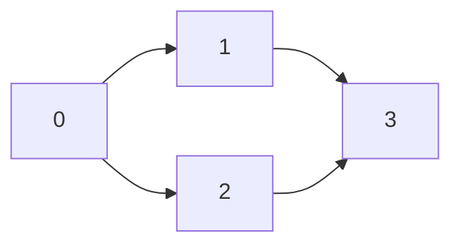

# All Paths From Source to Target

**Difficulty:** Medium
**LeetCode Link:** [Problem 797](https://leetcode.com/problems/all-paths-from-source-to-target/)

## Description
Given a directed acyclic graph (DAG) of n nodes labeled from 0 to n - 1, find all possible paths from node 0 to node n - 1 and return them in any order.

The graph is given as follows: graph[i] is a list of all nodes you can visit from node i (i.e., there is a directed edge from node i to node graph[i][j]).

## Visual Representation



```
Example graph:
graph = [[1,2],[3],[3],[]]

Node connections:
0 → [1, 2]
1 → [3]
2 → [3]
3 → []

All paths from 0 to 3:
Path 1: 0 → 1 → 3
Path 2: 0 → 2 → 3

Visualization:
    1
   ↗ ↘
  0   3
   ↘ ↗
    2

Another example:
graph = [[4,3,1],[3,2,4],[3],[4],[]]

    ┌─→ 1 ─→ 3
    │   ↓    ↓
  0 ┼─→ 4 ←──┘
    │   ↑
    └─→ 2

Paths from 0 to 4:
[0,4]
[0,3,4]
[0,1,3,4]
[0,1,4]
[0,1,2,3,4]
```

## Examples

**Example 1:**
```
Input: graph = [[1,2],[3],[3],[]]
Output: [[0,1,3],[0,2,3]]
Explanation: There are two paths: 0 -> 1 -> 3 and 0 -> 2 -> 3.
```

**Example 2:**
```
Input: graph = [[4,3,1],[3,2,4],[3],[4],[]]
Output: [[0,4],[0,3,4],[0,1,3,4],[0,1,2,3,4],[0,1,4]]
```

## Constraints
- n == graph.length
- 2 <= n <= 15
- 0 <= graph[i][j] < n
- graph[i][j] != i (i.e., there will be no self-loops)
- All the elements of graph[i] are unique
- The input graph is guaranteed to be a DAG
