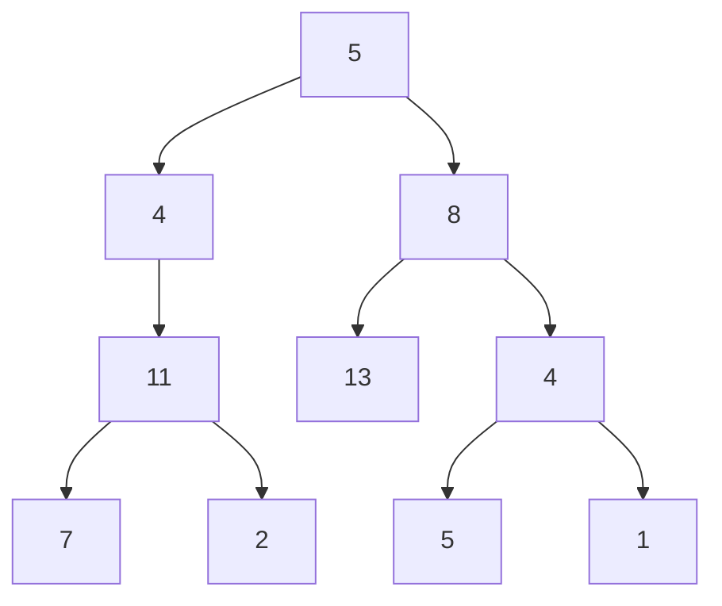

# Path Sum II

**Difficulty:** Medium
**LeetCode Link:** [Problem 113](https://leetcode.com/problems/path-sum-ii/)

## Description
Given the root of a binary tree and an integer targetSum, return all root-to-leaf paths where the sum of the node values in the path equals targetSum. Each path should be returned as a list of the node values, not node references.

A root-to-leaf path is a path starting from the root and ending at any leaf node. A leaf is a node with no children.

## Visual Representation



```
Example tree with targetSum = 22:
        5
       / \
      4   8
     /   / \
    11  13  4
   /  \    / \
  7    2  5   1

Root-to-leaf paths:
1. 5 → 4 → 11 → 7 = 27 (not matching)
2. 5 → 4 → 11 → 2 = 22 (MATCH!)
3. 5 → 8 → 13 = 26 (not matching)
4. 5 → 8 → 4 → 5 = 22 (MATCH!)
5. 5 → 8 → 4 → 1 = 18 (not matching)

Answer: [[5,4,11,2], [5,8,4,5]]

Visualization with matching paths:
        5
       / \
      4*  8*
     /   / \
    11* 13  4*
   /  \    / \
  7    2* 5*  1

(* = nodes in matching paths)
```

## Examples

**Example 1:**
```
Input: root = [5,4,8,11,null,13,4,7,2,null,null,5,1], targetSum = 22
Output: [[5,4,11,2],[5,8,4,5]]
Explanation: There are two paths whose sum equals targetSum:
5 + 4 + 11 + 2 = 22
5 + 8 + 4 + 5 = 22
```

**Example 2:**
```
Input: root = [1,2,3], targetSum = 5
Output: []
```

**Example 3:**
```
Input: root = [1,2], targetSum = 0
Output: []
```

## Constraints
- The number of nodes in the tree is in the range [0, 5000]
- -1000 <= Node.val <= 1000
- -1000 <= targetSum <= 1000
