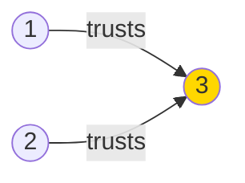

# Find the Town Judge

**Difficulty:** Easy
**LeetCode Link:** [Problem 997](https://leetcode.com/problems/find-the-town-judge/)

## Description
In a town, there are n people labeled from 1 to n. There is a rumor that one of these people is secretly the town judge.

If the town judge exists, then:
1. The town judge trusts nobody.
2. Everybody (except for the town judge) trusts the town judge.
3. There is exactly one person that satisfies properties 1 and 2.

You are given an array trust where trust[i] = [ai, bi] representing that the person labeled ai trusts the person labeled bi. If a trust relationship does not exist in trust array, then such a trust relationship does not exist.

Return the label of the town judge if the town judge exists and can be identified, or return -1 otherwise.

## Visual Representation



```
Trust relationships (n=3):
Person 1 → trusts → Person 3
Person 2 → trusts → Person 3
Person 3 → trusts → Nobody

Person 3 is the judge because:
✓ Everyone (1, 2) trusts person 3
✓ Person 3 trusts nobody
```

```
No judge scenario (n=3):
Person 1 → trusts → Person 2
Person 2 → trusts → Person 3
Person 3 → trusts → Person 1

Result: -1 (circular trust, no judge)
```

## Examples

**Example 1:**
```
Input: n = 2, trust = [[1,2]]
Output: 2
```

**Example 2:**
```
Input: n = 3, trust = [[1,3],[2,3]]
Output: 3
```

**Example 3:**
```
Input: n = 3, trust = [[1,3],[2,3],[3,1]]
Output: -1
```

## Constraints
- 1 <= n <= 1000
- 0 <= trust.length <= 10^4
- trust[i].length == 2
- All the pairs of trust are unique
- ai != bi
- 1 <= ai, bi <= n
