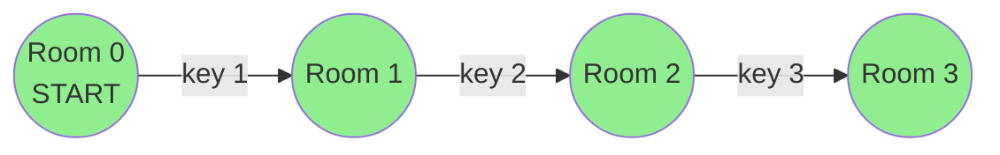

# Keys and Rooms

**Difficulty:** Medium
**LeetCode Link:** [Problem 841](https://leetcode.com/problems/keys-and-rooms/)

## Description
There are n rooms labeled from 0 to n - 1 and all the rooms are locked except for room 0. Your goal is to visit all the rooms. However, you cannot enter a locked room without having its key.

When you visit a room, you may find a set of distinct keys in it. Each key has a number on it, denoting which room it unlocks, and you can take all of them with you to unlock the other rooms.

Given an array rooms where rooms[i] is the set of keys that you can obtain if you visited room i, return true if you can visit all the rooms, or false otherwise.

## Visual Representation



```
Example 1: Can visit all rooms
rooms = [[1],[2],[3],[]]

Room 0 (unlocked): contains key to room 1
  └─> Room 1: contains key to room 2
       └─> Room 2: contains key to room 3
            └─> Room 3: no keys

Result: true (can visit all 4 rooms)
```

```
Example 2: Cannot visit all rooms
rooms = [[1,3],[3,0,1],[2],[0]]

Room 0 (unlocked): contains keys to rooms 1, 3
  ├─> Room 1: contains keys to rooms 3, 0, 1
  └─> Room 3: contains key to room 0

Room 2: LOCKED (no key found)

Result: false (cannot visit room 2)
```

## Examples

**Example 1:**
```
Input: rooms = [[1],[2],[3],[]]
Output: true
Explanation:
We visit room 0 and pick up key 1.
We then visit room 1 and pick up key 2.
We then visit room 2 and pick up key 3.
We then visit room 3.
Since we were able to visit every room, we return true.
```

**Example 2:**
```
Input: rooms = [[1,3],[3,0,1],[2],[0]]
Output: false
Explanation: We can not enter room number 2 since the only key that unlocks it is in that room.
```

## Constraints
- n == rooms.length
- 2 <= n <= 1000
- 0 <= rooms[i].length <= 1000
- 1 <= sum(rooms[i].length) <= 3000
- 0 <= rooms[i][j] < n
- All the values of rooms[i] are unique
