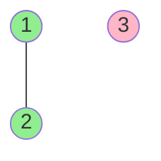

# Number of Provinces

**Difficulty:** Medium
**LeetCode Link:** [Problem 547](https://leetcode.com/problems/number-of-provinces/)

## Description
There are n cities. Some of them are connected, while some are not. If city a is connected directly with city b, and city b is connected directly with city c, then city a is connected indirectly with city c.

A province is a group of directly or indirectly connected cities and no other cities outside of the group.

You are given an n x n matrix isConnected where isConnected[i][j] = 1 if the ith city and the jth city are directly connected, and isConnected[i][j] = 0 otherwise.

Return the total number of provinces.

## Visual Representation



```
Connection Matrix:      Visual:
  1 2 3                 Province 1: 1---2
1[1 1 0]
2[1 1 0]                Province 2: 3 (isolated)
3[0 0 1]

Result: 2 provinces
```

```
Another Example:
  1 2 3
1[1 0 0]                Province 1: 1
2[0 1 0]                Province 2: 2
3[0 0 1]                Province 3: 3

Result: 3 provinces (all disconnected)
```

## Examples

**Example 1:**
```
Input: isConnected = [[1,1,0],[1,1,0],[0,0,1]]
Output: 2
```

**Example 2:**
```
Input: isConnected = [[1,0,0],[0,1,0],[0,0,1]]
Output: 3
```

## Constraints
- 1 <= n <= 200
- n == isConnected.length
- n == isConnected[i].length
- isConnected[i][j] is 1 or 0
- isConnected[i][i] == 1
- isConnected[i][j] == isConnected[j][i]
