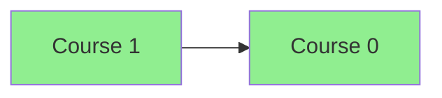
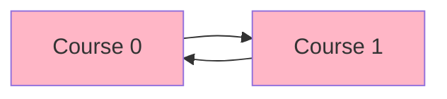

# Course Schedule

**Difficulty:** Medium
**LeetCode Link:** [Problem 207](https://leetcode.com/problems/course-schedule/)

## Description
There are a total of numCourses courses you have to take, labeled from 0 to numCourses - 1. You are given an array prerequisites where prerequisites[i] = [ai, bi] indicates that you must take course bi first if you want to take course ai.

For example, the pair [0, 1] indicates that to take course 0 you have to first take course 1.

Return true if you can finish all courses. Otherwise, return false.

## Visual Representation

```
Example 1: No Cycle (Can finish all courses)
numCourses = 2, prerequisites = [[1,0]]

    0 --> 1

Course dependency: Take course 0 before course 1
No cycle exists, so we can complete all courses.
```



```
Example 2: Cycle Detected (Cannot finish all courses)
numCourses = 2, prerequisites = [[1,0],[0,1]]

    0 <--> 1

Circular dependency: Course 0 requires Course 1, and Course 1 requires Course 0
Cycle exists, so we CANNOT complete all courses.
```



```
Example 3: Complex Graph with No Cycle
numCourses = 4, prerequisites = [[1,0],[2,0],[3,1],[3,2]]

        0
       / \
      v   v
      1   2
       \ /
        v
        3

Valid order: 0 -> 1 -> 2 -> 3 (or 0 -> 2 -> 1 -> 3)
```

## Examples

**Example 1:**
```
Input: numCourses = 2, prerequisites = [[1,0]]
Output: true
Explanation: There are a total of 2 courses to take. To take course 1 you should have finished course 0. So it is possible.
```

**Example 2:**
```
Input: numCourses = 2, prerequisites = [[1,0],[0,1]]
Output: false
Explanation: There are a total of 2 courses to take. To take course 1 you should have finished course 0, and to take course 0 you should also have finished course 1. So it is impossible.
```

**Example 3:**
```
Input: numCourses = 4, prerequisites = [[1,0],[2,0],[3,1],[3,2]]
Output: true
Explanation: There are several valid orderings, such as: [0,1,2,3] or [0,2,1,3]
```

## Constraints
- 1 <= numCourses <= 2000
- 0 <= prerequisites.length <= 5000
- prerequisites[i].length == 2
- 0 <= ai, bi < numCourses
- All the pairs prerequisites[i] are unique
