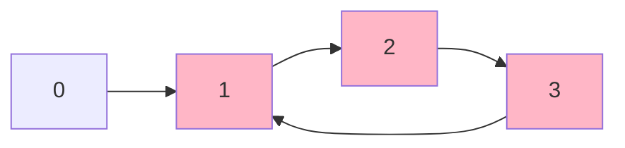
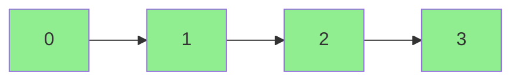

# Detect Cycle in Directed Graph

**Difficulty:** Medium
**GeeksforGeeks Link:** [Detect cycle in a directed graph](https://www.geeksforgeeks.org/problems/detect-cycle-in-a-directed-graph/1)

## Description
Given a Directed Graph with V vertices (numbered from 0 to V-1) and E edges, check whether it contains any cycle or not.

The graph is represented as an adjacency list, where adj[i] contains all the vertices that are directly reachable from vertex i.

Return true if the graph contains a cycle, otherwise return false.

## Visual Representation

```
Example 1: Graph with Cycle
V = 4, E = 4
adj = [[1], [2], [3], [1]]

    0 --> 1 --> 2
          ^     |
          |     v
          +---- 3

Cycle exists: 1 -> 2 -> 3 -> 1
```



```
Example 2: Graph without Cycle (DAG - Directed Acyclic Graph)
V = 4, E = 3
adj = [[1], [2], [3], []]

    0 --> 1 --> 2 --> 3

No cycle: This is a valid DAG
```



```
Example 3: Multiple Cycles
V = 5, E = 6
adj = [[1], [2], [0, 3], [4], [2]]

    0 --> 1 --> 2
    ^           |
    |           v
    +---------- 3 --> 4
                      |
                      +---+
                          v
                          2

Multiple cycles:
- Cycle 1: 0 -> 1 -> 2 -> 3 (back to somewhere)
- Cycle 2: 2 -> 3 -> 4 -> 2
```

## DFS Cycle Detection (Color Method)

```
White (0): Not visited
Gray (1):  Currently being processed (in recursion stack)
Black (2): Completely processed

If we encounter a GRAY node during DFS, we found a cycle!

    Start at 0 (White)
    |
    v
    0 becomes Gray --> Visit 1
                       |
                       v
                       1 becomes Gray --> Visit 2
                                          |
                                          v
                                          2 becomes Gray --> Visit 3
                                                             |
                                                             v
                                                             3 becomes Gray --> Visit 1
                                                                                |
                                                                                v
                                                                            1 is GRAY!
                                                                            CYCLE DETECTED!
```

## Examples

**Example 1:**
```
Input: V = 4, adj = [[1], [2], [3], [1]]
Output: true
Explanation: The graph contains a cycle: 1 -> 2 -> 3 -> 1
```

**Example 2:**
```
Input: V = 4, adj = [[1], [2], [3], []]
Output: false
Explanation: The graph is a DAG (Directed Acyclic Graph) with no cycles.
```

**Example 3:**
```
Input: V = 2, adj = [[1], [0]]
Output: true
Explanation: Simple cycle between nodes 0 and 1.
```

## Constraints
- 1 <= V, E <= 10^5
- 0 <= adj[i][j] < V
- The graph may contain self-loops and multiple edges
