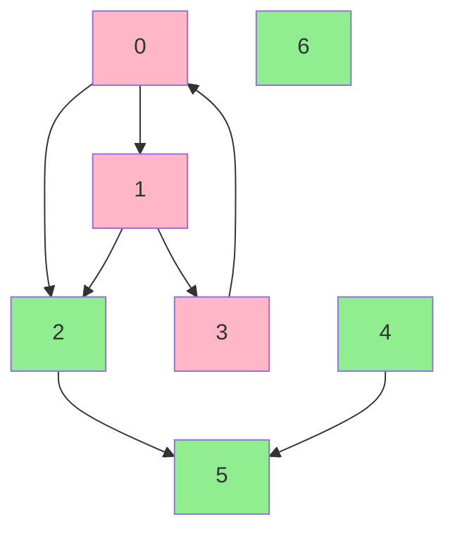

# Find Eventual Safe States

**Difficulty:** Medium
**LeetCode Link:** [Problem 802](https://leetcode.com/problems/find-eventual-safe-states/)

## Description
There is a directed graph of n nodes with each node labeled from 0 to n - 1. The graph is represented by a 0-indexed 2D integer array graph where graph[i] is an integer array of nodes adjacent to node i, meaning there is an edge from node i to each node in graph[i].

A node is a terminal node if there are no outgoing edges. A node is a safe node if every possible path starting from that node leads to a terminal node (or another safe node).

Return an array containing all the safe nodes of the graph. The answer should be sorted in ascending order.

## Visual Representation

```
Example 1:
graph = [[1,2],[2,3],[5],[0],[5],[],[]]

    0 --> 1 --> 2 --> 5 (terminal)
    |     |
    v     v
    2     3 --> 0 (cycle!)

    4 --> 5 (terminal)

    6 (terminal - no outgoing edges)

Safe nodes: [2, 4, 5, 6]
Unsafe nodes: [0, 1, 3] (part of or lead to cycle)

Analysis:
- Node 0: Leads to cycle (0 -> 1 -> 2 -> ... -> 3 -> 0) - UNSAFE
- Node 1: Leads to cycle - UNSAFE
- Node 2: Goes to 5 (terminal) - SAFE
- Node 3: Part of cycle (3 -> 0 -> ... -> 3) - UNSAFE
- Node 4: Goes to 5 (terminal) - SAFE
- Node 5: Terminal node - SAFE
- Node 6: Terminal node - SAFE
```



```
Example 2: Simple Case
graph = [[1,2,3,4],[1,2],[3,4],[0,4],[]]

    0 --> 1 --> 2 --> 3 --> 4 (terminal)
    |     |     |     |
    v     v     v     v
    2     2     4     0
    |           |
    v           |
    3           4
    |
    v
    4

Node 4 is terminal (no outgoing edges)
All paths from node 4 end at 4 itself - SAFE

Analysis by reverse DFS:
- Node 4: Terminal - SAFE
- Node 3: Goes to 0 (which has outgoing edges in cycle) and 4 - UNSAFE (leads to cycle)
- Node 2: Goes to 3 and 4 - UNSAFE (3 is unsafe)
- Node 1: Goes to 1 (self-loop!) and 2 - UNSAFE
- Node 0: Leads to unsafe nodes - UNSAFE

Safe nodes: [4]
```

```
Key Insight: Reverse the Graph!

Original Graph:          Reversed Graph:
0 -> 1                   0 <- 1
|    |                   ^    ^
v    v                   |    |
2 -> 5                   2 -> 5

In reversed graph, start from terminal nodes and do DFS.
Nodes reachable from terminals (in reversed graph) are SAFE in original graph!
```

## Examples

**Example 1:**
```
Input: graph = [[1,2],[2,3],[5],[0],[5],[],[]]
Output: [2,4,5,6]
Explanation:
- Nodes 5 and 6 are terminal nodes (no outgoing edges)
- Node 4 only leads to node 5
- Node 2 only leads to node 5
- Nodes 0, 1, and 3 are part of or lead to a cycle
```

**Example 2:**
```
Input: graph = [[1,2,3,4],[1,2],[3,4],[0,4],[]]
Output: [4]
Explanation: Only node 4 is a terminal node. All other nodes have paths that lead back to themselves or other cycles.
```

**Example 3:**
```
Input: graph = [[],[0,2,3,4],[3],[4],[]]
Output: [0,1,2,3,4]
Explanation: All nodes eventually lead to node 4 (terminal), so all nodes are safe.
```

## Constraints
- n == graph.length
- 1 <= n <= 10^4
- 0 <= graph[i].length <= n
- 0 <= graph[i][j] <= n - 1
- graph[i] is sorted in strictly increasing order
- The graph may contain self-loops
- The number of edges in the graph will be in the range [1, 4 * 10^4]
