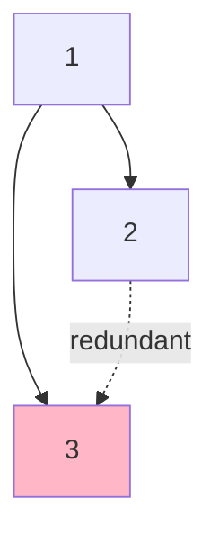
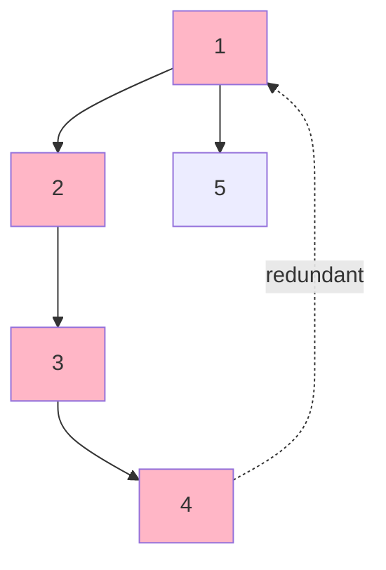

# Redundant Connection II

**Difficulty:** Hard
**LeetCode Link:** [Problem 685](https://leetcode.com/problems/redundant-connection-ii/)

## Description
In this problem, a rooted tree is a directed graph such that, there is exactly one node (the root) for which all other nodes are descendants of this node, plus every node has exactly one parent, except for the root node which has no parents.

The given input is a directed graph that started as a rooted tree with n nodes (with distinct values from 1 to n), with one additional directed edge added. The added edge has two different vertices chosen from 1 to n, and was not an edge that already existed.

The resulting graph is given as a 2D-array of edges. Each element of edges is a pair [ui, vi] that represents a directed edge connecting nodes ui and vi, where ui is a parent of child vi.

Return an edge that can be removed so that the resulting graph is a rooted tree of n nodes. If there are multiple answers, return the answer that occurs last in the given 2D-array.

## Visual Representation

```
Example 1: Node with Two Parents
edges = [[1,2],[1,3],[2,3]]

    1
   / \
  v   v
  2-->3  (Node 3 has TWO parents: 1 and 2!)

Node 3 has two incoming edges:
- From node 1: [1,3]
- From node 2: [2,3]

Removing [2,3] fixes the issue.
Result: 1 -> 2, 1 -> 3 (valid rooted tree)
```



```
Example 2: Cycle in Directed Graph
edges = [[1,2],[2,3],[3,4],[4,1],[1,5]]

    1 --> 2
    ^     |
    |     v
    4 <-- 3     1 --> 5

Cycle exists: 1 -> 2 -> 3 -> 4 -> 1
Removing [4,1] breaks the cycle.
```



```
Example 3: Both Issues Combined
edges = [[2,1],[3,1],[4,2],[1,4]]

     3
     |
     v
2 -> 1 -> 4
^         |
+---------+

Problems:
1. Node 1 has two parents (2 and 3)
2. Cycle exists: 2 -> 1 -> 4 -> 2

Must remove [1,4] (last edge creating both problems)
```

## Three Cases to Handle

```
Case 1: Node with Two Parents (No Cycle)
    1
   / \
  v   v
  2-->3

Two candidates: [1,3] or [2,3]
Try removing second occurrence first: [2,3]
Check if valid tree → YES
Return [2,3]

Case 2: Cycle Only (All nodes have ≤1 parent)
  1 → 2
  ↑   ↓
  4 ← 3

No node has two parents
But cycle exists: 1→2→3→4→1
Use Union-Find to detect cycle
Return edge that creates cycle: [4,1]

Case 3: Node with Two Parents AND Cycle
     3
     ↓
2 → 1 → 4
↑       ↓
+-------+

Node 1 has parents: 2 and 3
Cycle: 2→1→4→2

Two candidates: [2,1] and [3,1]
Try removing [3,1] first (last one): Graph still has cycle
Try removing [2,1]: Valid tree!
Return [2,1]
```

## Algorithm Overview

```
Step 1: Find node with two parents (if exists)
- Scan all edges
- Track indegree of each node
- If indegree[node] == 2, save both candidate edges

Step 2: Use Union-Find to detect cycles
- If no two-parent node: return edge that creates cycle
- If two-parent node exists:
  - Try removing second parent edge
  - If still has cycle, remove first parent edge
  - Return appropriate edge

Step 3: Return result
```

## Examples

**Example 1:**
```
Input: edges = [[1,2],[1,3],[2,3]]
Output: [2,3]
Explanation: Node 3 has two parents. Removing [2,3] (the last edge to node 3) creates a valid tree.
```

**Example 2:**
```
Input: edges = [[1,2],[2,3],[3,4],[4,1],[1,5]]
Output: [4,1]
Explanation: There's a cycle: 1->2->3->4->1. Removing [4,1] (last edge in the cycle) fixes it.
```

**Example 3:**
```
Input: edges = [[2,1],[3,1],[4,2],[1,4]]
Output: [1,4]
Explanation: Node 1 has two parents and there's a cycle. Removing [1,4] (the last occurring problematic edge) solves both issues.
```

## Constraints
- n == edges.length
- 3 <= n <= 1000
- edges[i].length == 2
- 1 <= ui, vi <= n
- ui != vi
- The input represents a directed graph
