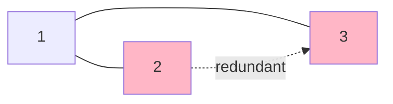
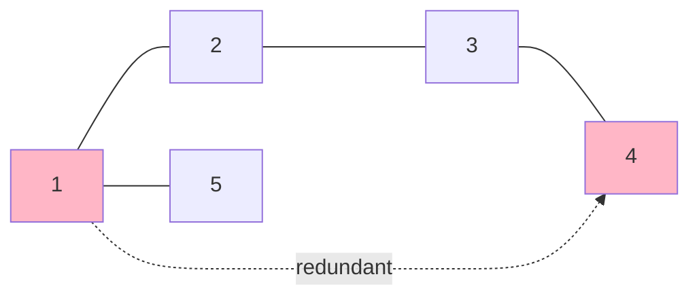

# Redundant Connection

**Difficulty:** Medium
**LeetCode Link:** [Problem 684](https://leetcode.com/problems/redundant-connection/)

## Description
In this problem, a tree is an undirected graph that is connected and has no cycles.

You are given a graph that started as a tree with n nodes labeled from 1 to n, with one additional edge added. The added edge has two different vertices chosen from 1 to n, and was not an edge that already existed. The graph is represented as an array edges of length n where edges[i] = [ai, bi] indicates that there is an edge between nodes ai and bi in the graph.

Return an edge that can be removed so that the resulting graph is a tree of n nodes. If there are multiple answers, return the answer that occurs last in the input.

## Visual Representation

```
Example 1:
edges = [[1,2],[1,3],[2,3]]

Before removing edge:    After removing [2,3]:
    1                        1
   / \                      / \
  2---3                    2   3
  (cycle!)               (valid tree)

The edge [2,3] creates a cycle.
Removing it results in a valid tree.
```



```
Example 2:
edges = [[1,2],[2,3],[3,4],[1,4],[1,5]]

Before removing:              After removing [1,4]:
      1                             1
     /|\                           /|\
    2 4 5                         2 3 5
    |/                            |
    3                             4

Path exists: 1-2-3-4
Adding edge [1,4] creates cycle: 1-2-3-4-1
```



```
Union-Find Approach:

Process edges in order:
1. [1,2]: Union(1,2) → {1,2}
2. [1,3]: Union(1,3) → {1,2,3}
3. [2,3]: Find(2) == Find(3)? YES! → CYCLE DETECTED
   Return [2,3]

Edge [2,3] connects two nodes already in same component.
This creates a cycle!
```

```
Step-by-step for [[1,2],[2,3],[3,4],[1,4],[1,5]]:

Initial: Each node is its own parent
parent = [0, 1, 2, 3, 4, 5]

Edge [1,2]: Union 1 and 2
parent = [0, 1, 1, 3, 4, 5]

Edge [2,3]: Union 2 and 3
parent = [0, 1, 1, 1, 4, 5]

Edge [3,4]: Union 3 and 4
parent = [0, 1, 1, 1, 1, 5]

Edge [1,4]: Find(1)=1, Find(4)=1 → Same parent! CYCLE!
Return [1,4]
```

## Examples

**Example 1:**
```
Input: edges = [[1,2],[1,3],[2,3]]
Output: [2,3]
Explanation: The edge [2,3] is redundant. Removing it leaves a valid tree.
```

**Example 2:**
```
Input: edges = [[1,2],[2,3],[3,4],[1,4],[1,5]]
Output: [1,4]
Explanation: The edge [1,4] is redundant because there's already a path 1->2->3->4.
```

**Example 3:**
```
Input: edges = [[1,2],[1,3],[3,1]]
Output: [3,1]
Explanation: Multiple edges create a cycle. We return the last one that occurs in the input.
```

## Constraints
- n == edges.length
- 3 <= n <= 1000
- edges[i].length == 2
- 1 <= ai < bi <= n
- ai != bi
- There are no repeated edges
- The given graph is connected
