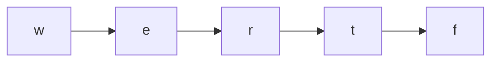

# Alien Dictionary

**Difficulty:** Hard
**LeetCode Link:** [Problem 269](https://leetcode.com/problems/alien-dictionary/)

**Note:** This is a LeetCode Premium problem.

## Description
There is a new alien language that uses the English alphabet. However, the order among the letters is unknown to you.

You are given a list of strings words from the alien language's dictionary, where the strings in words are sorted lexicographically by the rules of this new language.

Return a string of the unique letters in the new alien language sorted in lexicographically increasing order by the new language's rules. If there is no solution, return "". If there are multiple solutions, return any of them.

## Visual Representation

```
Example: words = ["wrt","wrf","er","ett","rftt"]

Character Dependencies:
w -> e  (from "wrt" vs "er")
t -> f  (from "wrt" vs "wrf")
r -> t  (from "er" vs "ett")
e -> r  (from "er" vs "ett")

Dependency Graph:
w -> e -> r -> t -> f

Topological Order: "wertf"
```



```
Comparing words pairwise:
"wrt"  vs "wrf"  -> t comes before f
"wrf"  vs "er"   -> w comes before e
"er"   vs "ett"  -> r comes before t
"ett"  vs "rftt" -> e comes before r
```

## Examples

**Example 1:**
```
Input: words = ["wrt","wrf","er","ett","rftt"]
Output: "wertf"
```

**Example 2:**
```
Input: words = ["z","x"]
Output: "zx"
```

**Example 3:**
```
Input: words = ["z","x","z"]
Output: ""
Explanation: The order is invalid, so return "".
```

## Constraints
- 1 <= words.length <= 100
- 1 <= words[i].length <= 100
- words[i] consists of only lowercase English letters
