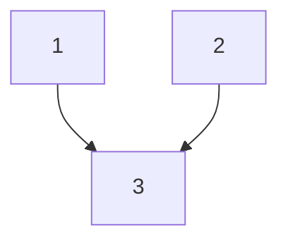

# Parallel Courses

**Difficulty:** Medium
**LeetCode Link:** [Problem 1136](https://leetcode.com/problems/parallel-courses/)

**Note:** This is a LeetCode Premium problem.

## Description
You are given an integer n, which indicates that there are n courses labeled from 1 to n. You are also given an array relations where relations[i] = [prevCoursei, nextCoursei], representing a prerequisite relationship between course prevCoursei and course nextCoursei: course prevCoursei has to be taken before course nextCoursei.

In one semester, you can take any number of courses as long as you have taken all the prerequisites in the previous semester for the courses you are taking.

Return the minimum number of semesters needed to take all courses. If there is no way to take all the courses, return -1.

## Visual Representation

```
Example: n = 3, relations = [[1,3],[2,3]]

Course Dependencies:
Course 3 depends on: 1, 2

Semester Plan:
Semester 1: Take courses 1, 2 (no prerequisites)
Semester 2: Take course 3 (prerequisites 1,2 completed)

Total semesters: 2
```



```
Semester-by-semester progression:
Semester 1: [1, 2]     (in-degree = 0)
Semester 2: [3]        (prerequisites satisfied)
```

## Examples

**Example 1:**
```
Input: n = 3, relations = [[1,3],[2,3]]
Output: 2
Explanation: The figure above represents the given graph.
In the first semester, you can take courses 1 and 2.
In the second semester, you can take course 3.
```

**Example 2:**
```
Input: n = 3, relations = [[1,2],[2,3],[3,1]]
Output: -1
Explanation: No course can be studied because they are prerequisites of each other.
```

## Constraints
- 1 <= n <= 5000
- 1 <= relations.length <= 5000
- relations[i].length == 2
- 1 <= prevCoursei, nextCoursei <= n
- prevCoursei != nextCoursei
- All the pairs [prevCoursei, nextCoursei] are unique
