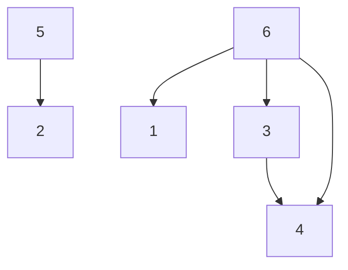

# Sort Items by Groups Respecting Dependencies

**Difficulty:** Hard
**LeetCode Link:** [Problem 1203](https://leetcode.com/problems/sort-items-by-groups-respecting-dependencies/)

## Description
There are n items each belonging to zero or one of m groups where group[i] is the group that the i-th item belongs to and it's equal to -1 if the i-th item belongs to no group. The items and the groups are zero indexed. A group can have no item belonging to it.

Return a sorted list of the items such that:
- The items that belong to the same group are next to each other in the sorted list
- There are some relations between these items where beforeItems[i] is a list containing all the items that should come before the i-th item in the sorted array (to the left of the i-th item)

Return any solution if there is more than one solution and return an empty array if there is no solution.

## Visual Representation

```
Example with 8 items and 2 groups:
group = [-1,-1,1,0,0,1,0,-1]
beforeItems = [[],[6],[5],[6],[3,6],[],[],[]]

Item Dependencies:
6 -> 1
5 -> 2
6 -> 3
3 -> 4
6 -> 4

Group Assignment:
Group -1: items 0, 1, 7 (no group)
Group 0: items 3, 4, 6
Group 1: items 2, 5

Group Dependency Graph:
Group 0 (has item 6) -> Group -1 (has item 1)
Group 1 (has item 5) -> Group 1 (has item 2)
Group 0 (has item 6) -> Group 0 (has items 3, 4)
```



## Examples

**Example 1:**
```
Input: n = 8, m = 2, group = [-1,-1,1,0,0,1,0,-1], beforeItems = [[],[6],[5],[6],[3,6],[],[],[]]
Output: [6,3,4,1,5,2,0,7]
Explanation: This is one valid solution, but there are more valid solutions:
- [6,3,4,1,5,2,7,0]
- [6,3,4,5,2,0,1,7]
etc.
```

**Example 2:**
```
Input: n = 8, m = 2, group = [-1,-1,1,0,0,1,0,-1], beforeItems = [[],[6],[5],[6],[3],[],[4],[]]
Output: []
Explanation: This is similar to Example 1 but item 4 must come before item 6 (beforeItems[6] = [4]).
However, item 6 must come before item 4 (beforeItems[4] = [6]). This creates a cycle, so there's no solution.
```

## Constraints
- 1 <= m <= n <= 3 * 10^4
- group.length == beforeItems.length == n
- -1 <= group[i] <= m - 1
- 0 <= beforeItems[i].length <= n - 1
- 0 <= beforeItems[i][j] <= n - 1
- i != beforeItems[i][j]
- beforeItems[i] does not contain duplicates elements
