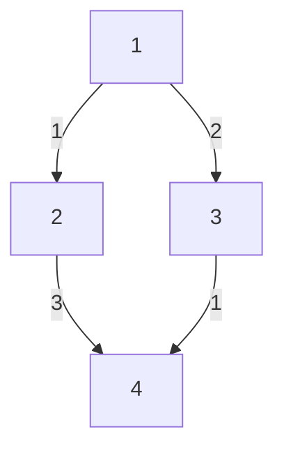

# Network Delay Time (Bellman-Ford Approach)

**Difficulty:** Medium
**LeetCode Link:** [Problem 743](https://leetcode.com/problems/network-delay-time/)

## Description
You are given a network of n nodes, labeled from 1 to n. You are also given times, a list of travel times as directed edges times[i] = (ui, vi, wi), where ui is the source node, vi is the target node, and wi is the time it takes for a signal to travel from source to target.

We will send a signal from a given node k. Return the minimum time it takes for all the n nodes to receive the signal. If it is impossible for all the n nodes to receive the signal, return -1.

## Visual Representation



```
Bellman-Ford Algorithm:
Relax all edges V-1 times

Initial: [∞, ∞, ∞, ∞]
Start from node k with distance 0

Iteration 1: Update direct neighbors
Iteration 2: Update 2-hop neighbors
...
Iteration V-1: All shortest paths found

Example: k=1, n=4
times = [[1,2,1],[1,3,2],[2,4,3],[3,4,1]]

After Bellman-Ford:
Node 1: 0
Node 2: 1 (from 1)
Node 3: 2 (from 1)
Node 4: 3 (from 3)

Max time = 3
```

## Examples

**Example 1:**
```
Input: times = [[2,1,1],[2,3,1],[3,4,1]], n = 4, k = 2
Output: 2
Explanation: Signal reaches node 2 at time 0, node 1 and 3 at time 1, and node 4 at time 2.
```

**Example 2:**
```
Input: times = [[1,2,1]], n = 2, k = 1
Output: 1
Explanation: Signal reaches node 2 at time 1.
```

**Example 3:**
```
Input: times = [[1,2,1]], n = 2, k = 2
Output: -1
Explanation: Node 1 is unreachable from node 2.
```

## Constraints
- 1 <= k <= n <= 100
- 1 <= times.length <= 6000
- times[i].length == 3
- 1 <= ui, vi <= n
- ui != vi
- 0 <= wi <= 100
- All the pairs (ui, vi) are unique (i.e., no multiple edges)

## Algorithm Notes
Bellman-Ford vs Dijkstra for this problem:
- **Bellman-Ford:** O(V*E), simpler implementation, handles negative weights
- **Dijkstra:** O((V+E) log V), faster for sparse graphs with non-negative weights
- For this problem, Dijkstra is typically preferred, but Bellman-Ford works well for learning
