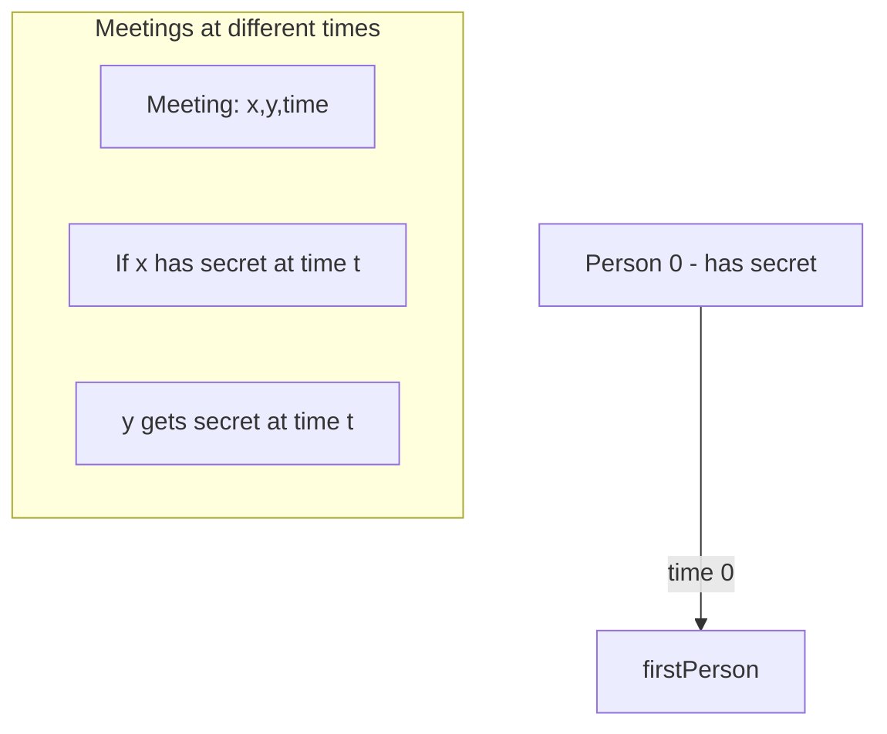

# Find All People With Secret

**Difficulty:** Hard
**LeetCode Link:** [Problem 2092](https://leetcode.com/problems/find-all-people-with-secret/)

## Description
You are given an integer n indicating there are n people numbered from 0 to n - 1. You are also given a 0-indexed 2D integer array meetings where meetings[i] = [xi, yi, timei] indicates that person xi and person yi have a meeting at timei. A person may attend multiple meetings at the same time. Finally, you are given an integer firstPerson.

Person 0 has a secret and initially shares the secret with person firstPerson at time 0. This secret is then shared every time a meeting takes place with a person that has the secret. More formally, for every meeting, if person xi has the secret at timei, then person yi will also have the secret after the meeting, and vice versa.

Return a list of all the people that have the secret after all the meetings have taken place. You may return the answer in any order.

## Visual Representation



```
Example: n=6, meetings=[[1,2,5],[2,3,8],[1,5,10]], firstPerson=1

Timeline:
Time 0: [0, 1] have secret
Time 5: Meeting [1,2] → [0, 1, 2] have secret
Time 8: Meeting [2,3] → [0, 1, 2, 3] have secret
Time 10: Meeting [1,5] → [0, 1, 2, 3, 5] have secret

Answer: [0, 1, 2, 3, 5]
```

## Examples

**Example 1:**
```
Input: n = 6, meetings = [[1,2,5],[2,3,8],[1,5,10]], firstPerson = 1
Output: [0,1,2,3,5]
Explanation:
At time 0, person 0 shares the secret with person 1.
At time 5, person 1 shares the secret with person 2.
At time 8, person 2 shares the secret with person 3.
At time 10, person 1 shares the secret with person 5.
Thus, people 0, 1, 2, 3, and 5 know the secret after all the meetings.
```

**Example 2:**
```
Input: n = 4, meetings = [[3,1,3],[1,2,2],[0,3,3]], firstPerson = 3
Output: [0,1,3]
Explanation:
At time 0, person 0 shares the secret with person 3.
At time 2, neither person 1 nor person 2 know the secret.
At time 3, person 3 shares the secret with person 1.
Thus, people 0, 1, and 3 know the secret after all the meetings.
```

**Example 3:**
```
Input: n = 5, meetings = [[3,4,2],[1,2,1],[2,3,1]], firstPerson = 1
Output: [0,1,2,3,4]
Explanation:
At time 0, person 0 shares the secret with person 1.
At time 1, person 1 shares the secret with person 2, and person 2 shares the secret with person 3.
Note that person 2 can share the secret at the same time as receiving it.
At time 2, person 3 shares the secret with person 4.
Thus, people 0, 1, 2, 3, and 4 know the secret after all the meetings.
```

## Constraints
- 2 <= n <= 10^5
- 1 <= meetings.length <= 10^5
- meetings[i].length == 3
- 0 <= xi, yi <= n - 1
- xi != yi
- 1 <= timei <= 10^5
- 1 <= firstPerson <= n - 1

## Algorithm Notes
This problem requires careful handling of:
- **Time-ordered processing:** Must process meetings in chronological order
- **Same-time meetings:** People meeting at the same time can all share the secret
- **Union-Find:** Can be used to group people at each time point
- **Graph connectivity:** At each timestamp, find connected components of people with the secret

Approaches:
- **Union-Find with time grouping:** Most efficient
- **BFS/DFS per timestamp:** Simpler but potentially slower
- **Floyd-Warshall:** Not recommended due to large n
